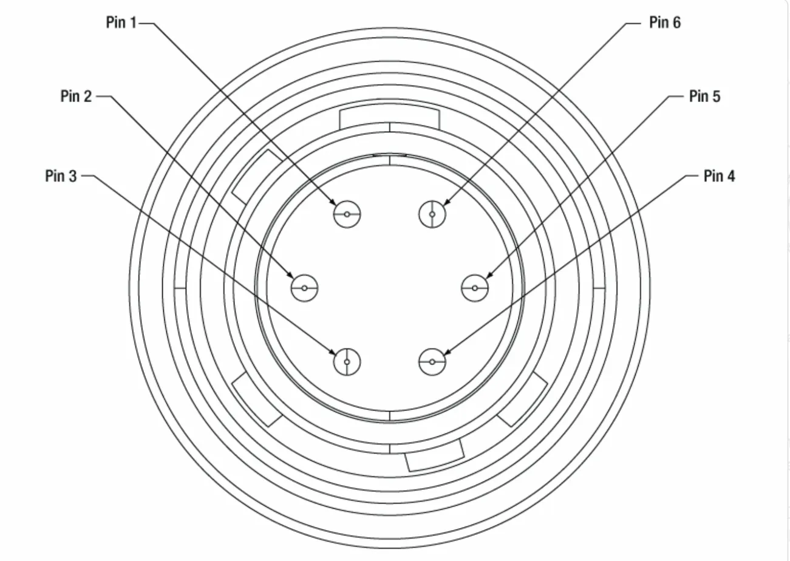
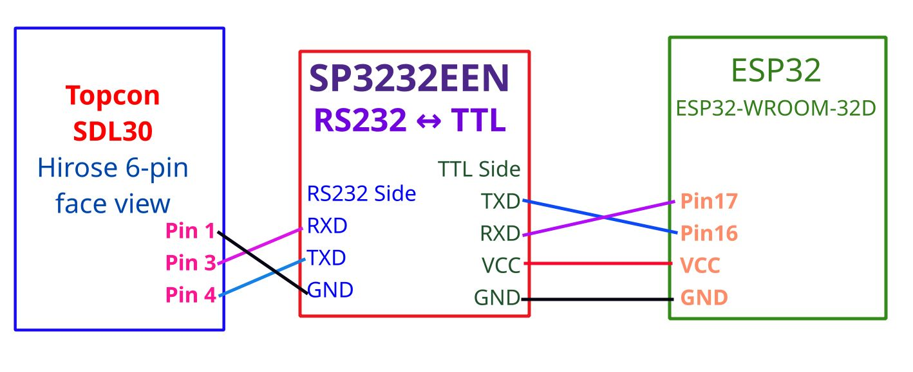

# SDL30 Collector V1 — Development Journal

> **"New life for an old instrument"**  
> A case study: replacing the broken Sokkia/Topcon SDR33 data collector  
> with an ESP32-based web UI for under ฿1,000.

---

## Background


*The broken Sokkia SDR33 — the inspiration for this project*

The **Sokkia SDL30** (also branded Topcon after the 2008 merger) is a high-quality digital barcode level manufactured around 1995, marketed as **"PowerLevel SDL30"**. Its original companion data collector was the **Sokkia SDR33** — a dedicated handheld device costing over $1,000 USD to replace.

When the SDR33 breaks (black screen, broken DB-25 connector cover held together with yellow tape!), the SDL30 becomes unusable for data recording — despite being a perfectly functional precision instrument.


*The Sokkia SDL30 "PowerLevel" — still measuring 0.3mm misclosure after ~30 years!*

This project replaces the SDR33 with:
- **ESP32-WROOM-32** (~฿200)
- **SP3232EEN RS232-TTL breakboard** (~฿50)
- **Custom USB-to-Hirose-6-pin cable** (Prolific PL2303)

**Total cost: under ฿500** vs $1,000+ for SDR33 replacement.

---

## Hardware

### Components

| Component | Description | Approx. Cost |
|-----------|-------------|-------------|
| ESP32-WROOM-32 | Main controller, WiFi AP | ฿200 |
| SP3232EEN breakboard | RS232 ↔ TTL level converter | ฿50 |
| Hirose HR10A-7P-6P cable | Custom cable, Prolific PL2303 | ฿200 |
| **Total** | | **< ฿500** |

### SDL30 RS-232 Connector

The SDL30 has a **Hirose HR10A-7P-6P** 6-pin circular connector on the back panel labelled **"DATA OUT"**.

> ⚠️ **CRITICAL — Pin numbering:**  
> Pin 1 is **counter-clockwise** from the key tab — face view.  
> Many online datasheets show clockwise — **WRONG** for this connector.  
> **Confirmed correct by field testing.**


*Hirose HR10A-7P-6P — counter-clockwise from key tab (top)*

| Pin | Wire Color | Signal | Direction |
|-----|-----------|--------|-----------|
| 1 | Black | GND | — |
| 2 | — | NC | — |
| 3 | White | TXD | SDL30 → ESP32 |
| 4 | Green | RXD | ESP32 → SDL30 |
| 5 | Red | NC | — |
| 6 | — | NC | — |

### Wiring Diagram



```
SDL30 Pin 1 (Black)  ──────────────────────── GND
SDL30 Pin 3 (White)  ── RS232 RXD  TTL TXD ── GPIO16 (UART2 RX)
SDL30 Pin 4 (Green)  ── RS232 TXD  TTL RXD ── GPIO17 (UART2 TX)
                        SP3232EEN   VCC   ── 3.3V
```

> TX/RX cross at SP3232EEN — TTL TXD → ESP32 GPIO16 (RX), TTL RXD → ESP32 GPIO17 (TX).

---

## SDL30 Protocol

### Communication Settings

From official Sokkia SDL30 manual (取扱説明書, section 13.3):

| Parameter | Factory Default* | This Project |
|-----------|-----------------|-------------|
| Baud rate | **1200** | **2400** |
| Parity | **None** | None |
| Measurement mode | **Single** | Single |

> Change baud in SDL30: `MENU → 4.Config → 4.RS-232 → Baud=2400`  
> Settings are saved after power off.

### Operating Screen

From manual section 14 (重要):
> *"SDL30 only receives commands in Status mode or Menu mode."*

**Status mode = Ht-diff standby screen:**
```
Meas
     Rh    xxxx m
S  Hd    yyyy m
```
`LM\r` works from this screen AND from the sub-menu screen — SDL30 returns to standby after measurement.

If MENU button accidentally pressed → press **ESC** to return.

### Command Reference

From manual section 14.2:

**Basic commands:**

| Command | Description |
|---------|-------------|
| `LM\r` | Start measurement, output result |
| `LT\r` | Stop measurement (silent in Single mode) |

**Data output commands:**

| Command | Response | Description |
|---------|----------|-------------|
| `LA\r` | `LA SDL30,001786,1112\r\n` | Model, serial, ROM version |
| `LB\r` | `LB 0,0\r\n` | Display digits parameter |

**Setting commands:**

| Command | Description |
|---------|-------------|
| `LXa\r` | Set Single measurement (factory default) |
| `LXb\r` | Set Continuous (precise) |
| `LXe\r` | Set Continuous (rough) |

**Data input command:**

| Command | Description |
|---------|-------------|
| `L/B 0,x\r` | Set display to 0.0001m resolution |
| `L/B 1,x\r` | Set display to 0.001m resolution |

### Response Formats (section 14.3)

**LM — Measurement:**
```
Manual documentation:    "LM _ -9.9999, 999.999\r\n"
Real SDL30 (SN:001786):  "LM 0.7890,1.88\r\n"

Differences vs manual:
  ✗ No + sign on positive values
  ✗ No leading zeros on distance
  ✗ No space after comma
  ✓ Space after "LM" prefix
  ✓ CR+LF terminator
```

**LA — Instrument info:**
```
Format:  "LA SDL30,123456,0100\r\n"
           model  serial  ROM(4 digits)
Real:    "LA SDL30,001786,1112\r\n"
```

**Error response:**
```
Format:  "LM Exxx\r\n"   (xxx = 3-digit code)
```

### Error Codes (section 15)

| Code | Cause |
|------|-------|
| E400, E401, E405, E406 | System error — contact service |
| E410–E429 | Measurement error: not sighting staff / out of focus / staff obscured / too close or far / shadow / light entering eyepiece |

---

## Software Architecture

### Framework
- **ESP-IDF v5.4**
- **FreeRTOS** tasks
- **SPIFFS** (875KB available)
- **ESP HTTP Server**
- **cJSON**

### Project Structure

```
sdl30_collector/
├── CMakeLists.txt
├── sdkconfig.defaults
├── partitions.csv          ← 960KB SPIFFS
└── main/
    ├── config.h            ← baud=2400, GPIO, WiFi, limits
    ├── main.c              ← app_main, SDL30 monitor task
    ├── sdl30_types.h       ← sight_type_t enum
    ├── settings.h/c        ← survey settings + SPIFFS save
    ├── sdl30/sdl30.h/c     ← UART: LM/LA/LB/LT
    ├── survey/survey.h/c   ← leveling arithmetic
    ├── survey/job.h/c      ← jobs, records, CSV
    ├── storage/storage.h/c ← SPIFFS init, file I/O
    └── web/
        ├── web_server.h/c  ← WiFi AP, 15 REST endpoints
        └── web_ui.h        ← 5-tab SPA embedded
```

### WiFi AP
```
SSID: SDL30_Collector  Password: survey1234  IP: 192.168.4.1
```

---

## Web UI — 5 Tabs

### Tab 1: Measure
- Status: Job, HI, RL, Readings, Points
- Sight: **[BS] [FS]** (leveling) or **[BS] [FS] [IS]** (SET-OUT)
- Auto-advance: BS→FS, FS→BS
- WiFi pre-warm on screen wake (visibilitychange)

### Tab 2: Records
**Top — running summary (side by side):**

| Arithmetic | Dist Balance |
|-----------|-------------|
| Σ BS | Σ BS dist |
| Σ FS | Σ FS dist |
| ΣBS−ΣFS | Diff |
| BS-FS | Limit |
| 1st Elev. | PASS / FAIL |
| **Last RL** (after FS) or **Last HI** (after BS) | |

**Bottom — observation table:** #, Sight, Staff, Dist, HI, RL, [delete]

### Tab 3: Jobs
Active job, BM, Download CSV, Create job, Storage bar, Job list

### Tab 4: Report

```
MISCLOSURE REPORT          DISTANCE REPORT
Opening BM + ΣBS - ΣFS    ΣBS Dist + ΣFS Dist
= Comp. Elev  (hint)       = Total Dist  (hint)

Σ BS    +x.xxxx m          Σ BS dist  xx.xxx m
Σ FS    +x.xxxx m          Σ FS dist  xx.xxx m
ΔElev   ±x.xxxx m          Dist Bal.  xx.xxx m < OK
Comp.   x.xxxx m           Total dist xx.xxx m
Closing x.xxxx m
Misclose ±x.xxxx m (x.xmm)
  GREEN(<5mm) ORANGE(<20mm) RED(≥20mm)
Points  n
Readings n
```

Export: **CSV** ✅ | GSI-16 (pending) | M5/Zeiss (pending)

### Tab 5: Settings
Method (BF/BFFB/BFBF/BBFF/SET-OUT), limits, alerts, baud

---

## Observation Methods

| Method | Pattern | IS | PASS/FAIL |
|--------|---------|-----|----------|
| **BF** | BS,FS,BS,FS... | No | Arithmetic only |
| BFFB | BS,FS,FS,BS | No | Phase 2 |
| BFBF | BS,FS,BS,FS | No | Phase 2 |
| BBFF | BS,BS,FS,FS | No | Phase 2 |
| SET-OUT | BS+IS pegs | Yes | Design RL |

---

## REST API

| Method | Endpoint | Description |
|--------|----------|-------------|
| GET | `/` | Web UI SPA |
| GET | `/api/status` | Job, HI, RL, SDL30 status |
| GET | `/api/records` | All records |
| GET | `/api/jobs` | Job list + storage |
| GET | `/api/download` | CSV download |
| GET | `/api/misclose?closing_rl=x` | Misclose calc |
| GET | `/api/settings` | Settings |
| POST | `/api/measure` | Trigger LM |
| POST | `/api/sight` | Set next sight |
| POST | `/api/job/new` | Create job |
| POST | `/api/job/select` | Select job |
| POST | `/api/job/bench` | Set opening BM |
| POST | `/api/job/delete` | Delete job |
| POST | `/api/record/delete` | Delete record |
| POST | `/api/settings` | Save settings |

---

## CSV Format

```csv
Point,Sight,Staff(m),Distance(m),HI(m),RL(m),Status
1,BS,0.8596,1.8700,100.8596,100.0000,OK
2,FS,0.6871,1.8600,100.8596,100.1725,OK
```

---

## Build & Flash

```bash
get_idf                                    # load ESP-IDF
cd ~/dev/sdl30_collector
rm -rf build                               # clean (first time)
idf.py build
idf.py -p /dev/ttyUSB0 flash monitor
```

---

## Known Issues

| Issue | Cause | Solution |
|-------|-------|----------|
| LM timeout after idle | Android WiFi sleep | visibilitychange pre-warm ✅ |
| MENU button pressed | Operator error | LM still works from sub-menu ✅ |
| uint32_t format error | xtensa compiler | Use `%lu` + `(unsigned long)` cast ✅ |

---

## Field Test Results

| Test | Misclosure | Notes |
|------|-----------|-------|
| Indoor closed loop | **0.7mm** 🟢 | 4 readings, 3 points |
| House floor survey | **0.3mm** 🟢🏆 | 6 readings, 4 points, 21m total |

House floor: 7.3mm height difference corner to corner — excellent construction!

---

## Pending

- [ ] GSI-16 export
- [ ] M5/Zeiss export
- [ ] CSV 4 decimal places for round numbers
- [ ] SET-OUT full implementation
- [ ] BFFB/BFBF/BBFF Phase 2

---

## Version History

| Version | Date | Notes |
|---------|------|-------|
| V1.0 | April 2026 | BF method, 5-tab web UI, CSV, WiFi fix |

---

## Credits

- **Instrument:** Sokkia PowerLevel SDL30 (SN:001786, ROM:1112)
- **Original recorder:** Sokkia SDR33 (broken — black screen, DB-25 cover damaged)
- **Developer:** Prajuab — 30 years surveying, Thailand
- **Inspiration:** *"Life finds a way!"* — Ian Malcolm, Jurassic Park 🦕

---

*"SDL30 lives again!"* 🎉
